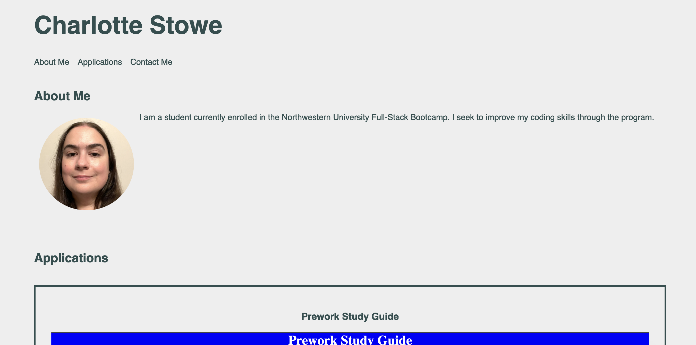

# personal-professional-portfolio-page
Challenge 2: Personal Professional Portfolio Page

## Description

This web document is a personal professional portfolio page for me. It uses CSS to style the page including flexbox and a media query. 

[Deployed web document: https://charlotte-st.github.io/personal-professional-portfolio-page/](https://charlotte-st.github.io/personal-professional-portfolio-page/)

## Installation

N/A

## Usage

This portfolio page displays a personal statement, a photo, my applications, and my contact information. It is intended to provide users with information about me, links to my work, and information on how to contact me.

## Credits

[normalize.css v8.0.1 Copyright © Nicolas Gallagher and Jonathan Neal](https://github.com/necolas/normalize.css) used under an MIT License 

Icons for Github and LinkedIn provided by [Font Awesome](https://fontawesome.com/). 

Starting files for the Pre-Work Study Guide and the Horiseon Social Solution Services webpage shown as applications on this page were provided by the Northwestern Full-Stack Coding Bootcamp. 

## License

Please refer to the LICENSE in the repo.

